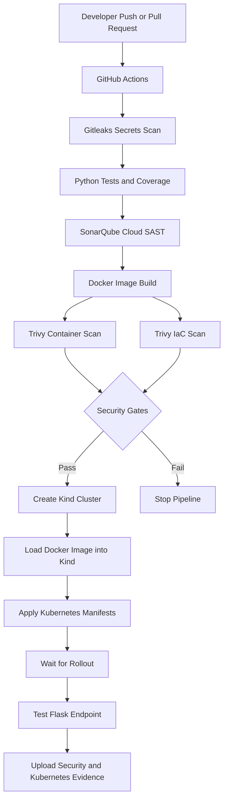

# 🔐 Secure DevSecOps CI/CD Pipeline

[](https://github.com/Venuluck/secure_cicd_pipeline/actions/workflows/devsecops-pipeline.yml)

[](https://sonarcloud.io/summary/new_code?id=Venuluck_secure_cicd_pipeline)
[](https://sonarcloud.io/summary/new_code?id=Venuluck_secure_cicd_pipeline)
[](https://sonarcloud.io/summary/new_code?id=Venuluck_secure_cicd_pipeline)


---
## 📖 Overview

This project demonstrates a **production-style DevSecOps CI/CD pipeline** that integrates multiple security tools into the software development lifecycle.

The application is built using **Python Flask**, containerized with **Docker**, scanned using multiple security tools, and prepared for deployment to **Kubernetes** using **GitHub Actions**.

The primary goal of this project is to demonstrate modern DevSecOps practices including:

- Static Application Security Testing (SAST)
- Software Composition Analysis (SCA)
- Container Security
- Secure CI/CD
- Kubernetes Deployment
- Infrastructure as Code (Terraform - Optional)

---

## Architecture



# 🚀 Tech Stack

| Technology | Purpose |
|------------|---------|
| Python Flask | Sample Web Application |
| Docker | Containerization |
| GitHub Actions | CI/CD |
| SonarQube | Static Code Analysis |
| Trivy | Container & IaC Security |
| OWASP Dependency Check | Dependency Vulnerability Scanning |
| Kubernetes (Kind) | Container Orchestration |
| Terraform | Infrastructure as Code (Optional) |

---

# 🔒 Security Features

✅ Static Application Security Testing (SAST)

✅ Container Image Scanning

✅ Software Composition Analysis (SCA)

✅ Infrastructure as Code Scanning

✅ Docker Security Best Practices

✅ Kubernetes Security Context

✅ Network Policies

✅ Automated Security Checks

---

# 📂 Project Structure

```
secure-cicd-pipeline
│
├── app/
│   ├── app.py
│   └── requirements.txt
│
├── reports/
│   ├── trivy/
│   └── dependency-check/
│
├── k8s/
│
├── terraform/
│
├── .github/
│   └── workflows/
│       └── secure-cicd.yml
│
├── Dockerfile
├── .dockerignore
├── .gitignore
├── sonar-project.properties
└── README.md
```

---

# ⚙️ Local Setup

## Clone Repository

```bash
git clone https://github.com/Venuluck/secure_cicd_pipeline.git

cd secure_cicd_pipeline
```

---

## Run Flask App

```bash
python -m venv venv

venv\Scripts\activate

pip install -r app/requirements.txt

python app/app.py
```

Visit:

```
http://localhost:5000
```

---

## Docker

Build Image

```bash
docker build -t secure-app .
```

Run Container

```bash
docker run -p 5000:5000 secure-app
```

---

# 🔎 Security Scanning

## SonarQube

```bash
sonar-scanner
```

---

## Trivy

```bash
trivy image secure-app
```

---

## OWASP Dependency Check

```bash
dependency-check --scan .
```

---

# ☸ Kubernetes Deployment

```bash
kind create cluster

kubectl apply -f k8s/

kubectl get pods
```

---

# 🔄 CI/CD Pipeline

The GitHub Actions pipeline performs the following steps:

- Checkout Repository
- Install Python Dependencies
- Build Docker Image
- Run SonarQube Scan
- Run Trivy Scan
- Run Dependency Check
- Upload Security Reports
- Deploy to Kubernetes

---

# 📊 Security Reports

Security reports are generated automatically inside:

```
reports/
```

- Trivy Report
- Dependency Check Report

---

# 📸 Screenshots

Add screenshots of:

- GitHub Actions Pipeline
- SonarQube Dashboard
- Trivy Scan
- Dependency Check Report
- Docker Build
- Kubernetes Pods

---

# 🎯 Learning Outcomes

This project demonstrates knowledge of:

- DevSecOps
- Secure CI/CD
- Docker Security
- Kubernetes
- GitHub Actions
- Container Security
- SAST
- Dependency Scanning
- Infrastructure as Code
- Cloud Security Fundamentals

---

# 👨‍💻 Author

**Venu Pydala**

GitHub:

https://github.com/Venuluck

LinkedIn:

https://www.linkedin.com/in/venu-p-24311b201/ 

---
